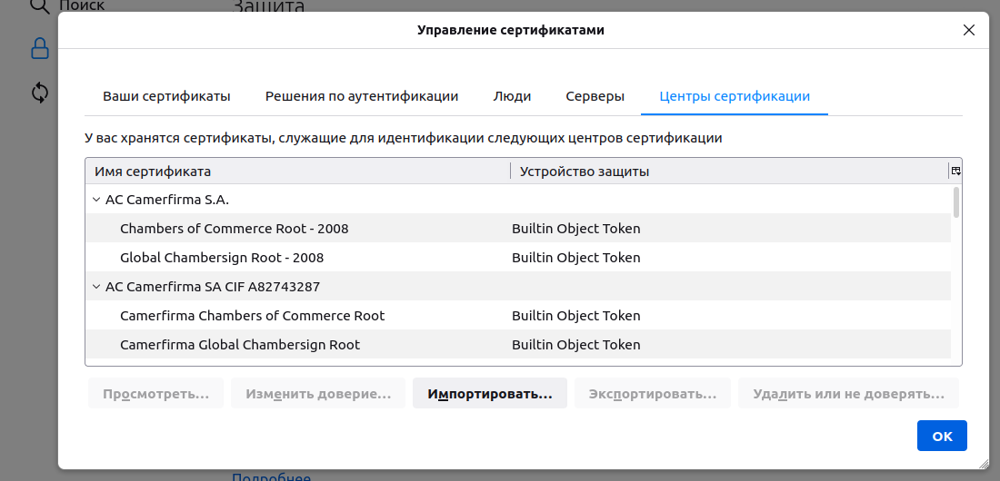
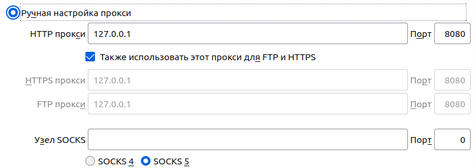
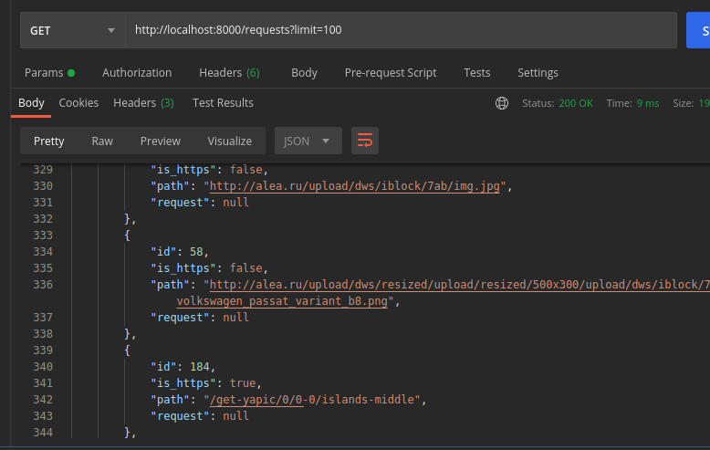
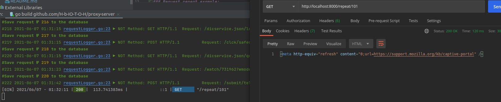
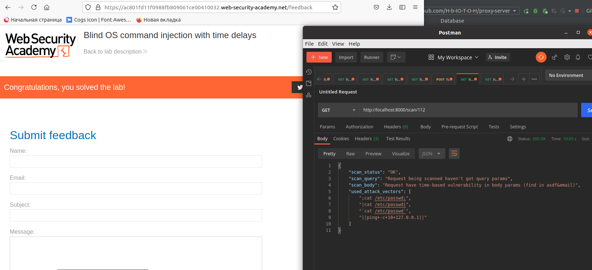

# proxy-server
proxy-server on golang for Technopark security curse.

[Subject](https://docs.google.com/document/d/1QaQ-Nc_eE4dBKZwQbA4E2o8pOJ3CktgsKDAn375iY24/edit)

### Build And Run:
#### Docker
```shell
sudo docker build -t proxy .
sudo docker run -p 8080:8080 -p 8000:8000 -t proxy
```
### Program arguments
```
method = [post,get,delete,put,connect,...] - Specify http method for save like method='post'
save = [true/false] - Specify save option on database (if false your session won't be saved) 
length = [1..] - Specify max uri length like length='150'
```

### Usage:
 - configure proxy server in browser settings:
   
 - add proxy-server certificate ca.crt to trusted certificates in your browser:
   
 - list all saved requests using /requests?limit=int:
   
 - you can resend each request using /repeat/id
   
 - you can scan post request using /scan/id for
   command injection – all GET/POST params test with
   ;cat /etc/passwd;
   |cat /etc/passwd|
   `cat /etc/passwd`
   in server answer try to find "root:"

Example of vulnerability search in [portswigger](https://portswigger.net/web-security/os-command-injection) os command injection tasks:
